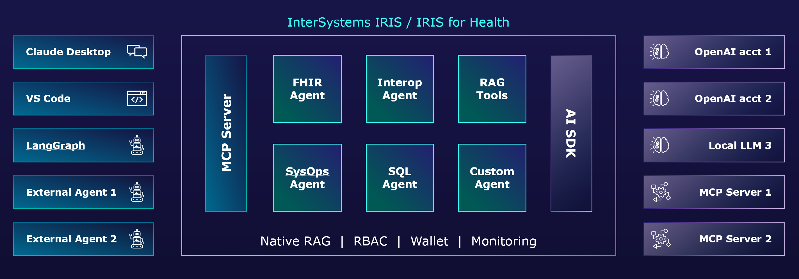

# InterSystems AI Hub EAP

Welcome to the Early Access Program for the InterSystems AI Hub! 
The [InterSystems AI Hub](#what-is-the-ai-hub) helps InterSystems customers accelerate their AI development and govern their use of AI assets. Whether you're looking for a native IRIS experience to build agents from scratch, expose IRIS-based business logic to external agents, or operationalize a langchain app by integrating it with the IRIS security model, the AI Hub gets you going as fast as you can say G-P-T.

See below for instructions to download and install the software, and an overview of the documentation per use case. 

> [!IMPORTANT]
> As part of the EAP, we're making pre-release software available through this portal.  We're working hard to get the packaging and integration with core IRIS features, including credential management, right and therefore some of the APIs and access control features are likely to change in the course of the API. We intend to document such changes here, in the change log at the bottom of the page.

> [!CAUTION]
> This pre-release software is not meant to be used in production environments.

For any questions, bug reports or other feedback, please use the Issues section of this repository.

## Accessing the software

You can download full kits or docker container images that include the latest InterSystems AI Hub updates from the [Early Access Program portal](https://evaluation.intersystems.com/Eval/early-access/AIHub). 

> [!NOTE]
> In the instructions below, please note the version number is included in some of the file names, and you may need to adjust the commands to match the files you downloaded.

No specific license is required to use the AI Hub. You can use your regular development license. 

The kits posted on this page can be installed like a normal InterSystems IRIS kit using interactive or silent installer. 

When using a container image, use the following commands to import and launch the image after downloading:
```Shell
docker image load -i /path/to/iris-2026.2.0AI.141.0-docker.tar.gz

docker run --name iris-ai-hub -p 1972:1972 -p 52773:52773 -d --volume /path/to/license-key:/external/keys intersystems/iris:2026.2.0AI.141.0 -k /external/keys/iris-container-x64.key
```
For more about optional parameters, such as `--key` and `--volume`, see the documentation on [running IRIS in containers](https://docs.intersystems.com/irislatest/csp/docbook/DocBook.UI.Page.cls?KEY=AFL_containers#AFL_containers_deploy_run1).

To change the default password, see the documentation above or use the following commands:
```Shell
docker exec -it iris-ai-hub iris session iris -U %SYS

%SYS> write ##class(Security.Users).UnExpireUserPasswords("*")
```

## What is the AI Hub?

The AI Hub consists of two main pieces:

The **AI SDK** helps users who develop applications on IRIS to take advantage of AI resources such as AI models (with an initial focus on LLMs) and external MCP Servers. It offers an API that abstracts over the specifics of the various AI service providers' own APIs and governs access to these using IRIS RBAC policies, consistent with the security model of the rest of your IRIS based logic. 
The AI SDK is available for ObjectScript, Python, and Java developers. For Python and Java, we're ensuring this is familiar to developers already working with AI by implementing the [langchain](https://docs.langchain.com/) and [LangChain4J](https://docs.langchain4j.dev/) APIs, respectively, but ensuring access to resources is governed through the same IRIS Config Store.

The **MCP Server** facilitates exposing customer business logic and existing IRIS functionality through an MCP Server, such that Agents and other external MCP Clients can easily include this in their agentic workflows. Again, access to these is governed using standard IRIS RBAC policies. 
Exposing business logic as MCP tools can be achieved entirely declaratively, either using an XData block in a class definition, or a simple user interface.



The blocks in the middle of the diagram represent MCP Server and toolset definitions that we'll build on top of the MCP Server capability and will start making available as part of future IRIS releases.

> [!NOTE]
> Not all capabilities have been fully implemented or included in the available kits, please check in regularly for updates, or subscribe to this repo for updates!

## How to use the AI Hub?

The AI Hub offers dedicated experiences for specific audiences and use cases:

### :lobster: I've got my own agent, just give me tools!

If you're not looking to develop, but rather wire an AI such as Claude Desktop to your existing business logic or data, the AI Hub includes an MCP Server capability that allows you to publish your IRIS-native code and data as tools. Through a low-code interface, you can assemble a toolset that contains any combination of class methods, SQL or FHIR queries, and Business Services, and choose the security policies appropriate for your scenario.

* [MCP Server guide](MCP_Server_Guide.md)
* [Declarative toolset definition](ObjectScript_SDK_Guide.md#building-toolsets)
* [Toolset definition UI] (forthcoming)

### :robot: I'm an IRIS developer, looking to build an agent

The AI Hub includes a rich SDK for ObjectScript developers who want to build AI apps or agents using intuitive abstractions that run natively on IRIS. 
We take care of the plumbing, security, accounting, and other boring stuff so you can innovate faster and teach that agent exactly what's specific to your business. 

* [ObjectScript guide - basics](ObjectScript_SDK_Guide.md)
* [ObjectScript guide - advanced features](ObjectScript_SDK.Advanced.md)
* [ObjectScript examples](ObjectScript_SDK_Examples.md)

### :snake: I'm a langchain developer, looking to deploy to production

If you're developing in [langchain](https://docs.langchain.com/), the leading Python framework for developing AI applications, you can easily integrate your app with the IRIS security model. Simply store the configuration and credentials for hosted LLMs and remote MCP Servers in the [Config Store](#the-config-store) on IRIS and avoid having to juggle those through impractical environment variables or files. IRIS will not only enforce Role-Based Access Control (RBAC) policies, but can also take care of auditing and offer a central point of governance. 
This same langchain extension also offers access to our `VectorStore` implementation, exposing IRIS Vector Search to langchain users.

* [langchain guide](langchain_SDK.md) (forthcoming)

### :coffee: I'm a LangChain4J developer, looking to deploiy to production

An experience very similar to the Python one for langchain described above will soon be available for [LangChain4J](https://docs.langchain4j.dev/).

* [LangChain4J guide] (forthcoming)

### :lock: The Config Store

While not specific to the AI Hub, this EAP distribution also includes a new feature called the Config Store, which enables secure storage and governed access to various types of configurations, for example to reach out to external systems. It stores credentials and other secrets in the [IRIS Wallet](https://docs.intersystems.com/irislatest/csp/docbook/Doc.View.cls?KEY=ROARS_secrets_mgmt), adding a convenient mechanism to manage the coordinates and settings that complement those credentials. 
The different components in the AI Hub are all designed to find LLM and remote MCP server configurations in this new store.

You can find an example of how to use the config store as part of the [langchain guide](langchain_SDK.md)

## How to reach out

If you have any questions or feedback, please file them as issues on this repository, which makes them visible for the combined InterSystems team, or send them straight through email to [Benjamin De Boe](mailto:benjamin.de.boe@intersystems.com).